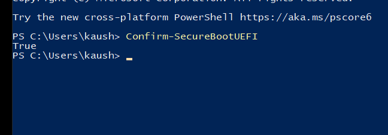

# ObscuraKM

A modular x64 Windows Kernel Driver providing comprehensive runtime system attribute abstraction across registry structures, kernel globals, shared user data pages, and EFI firmware query interfaces.

<p align="center">
  
</p>

---

## Technical Overview

Modern Windows operating systems expose system status and firmware state through multiple independent query layers. `ObscuraKM` synchronizes and patches all query vectors simultaneously upon driver entry.

### Primary Interception Vectors

| Target Vector | Method | Target Address / Identifier |
| :--- | :--- | :--- |
| **Registry Query Layer** | Direct `ZwSetValueKey` persistence | `HKLM\SYSTEM\CurrentControlSet\Control\SecureBoot` |
| **System Information Class 145** | Pattern-guided displacement patch | `SeSecureBootQueryInformation` kernel global |
| **SharedUserData Structure** | Direct page write | `KUSER_SHARED_DATA` (`0xFFFFF78000000000`) |
| **EFI Environment Variables** | Inline MDL trampoline hook | Unexported `NtQuerySystemEnvironmentValueEx` |

---

## Architectural Breakdown

### 1. Registry Interface Abstraction (`obscura::registry`)
Manipulates hardware and servicing policy flags directly within the kernel registry hive.
- Writes `UEFISecureBootEnabled` and `SecureBootCapable` under `SecureBoot\State`.
- Configures `DeviceAttributes` under `SecureBoot\Servicing`.
- Performs direct `ZwSetValueKey` operations without registering `CmRegisterCallbackEx` routines.

### 2. Kernel Memory Global Interception (`obscura::firmware`)
Scans `ntoskrnl.exe` image sections to locate internal displacement structures:
- Locates RIP-relative global flags evaluated by `NtQuerySystemInformation(SystemPolicyInformation / Class 145)`.
- Updates system capability bits (`0x09`) directly within kernel memory space.

### 3. KUSER_SHARED_DATA Page Patch
Accesses the non-paged `KUSER_SHARED_DATA` mapping at virtual address `0xFFFFF78000000000`:
- Updates `DbgSecureBootEnabled` bit flag at offset `0x2EC`.
- Avoids MDL mapping requirements by leveraging pre-mapped kernel-writable space.

### 4. Firmware Routine Interception (`NtQuerySystemEnvironmentValueEx`)
Locates the unexported `ntoskrnl` firmware query routine using a byte pattern signature:
- Allocates an executable non-paged trampoline pool (`ExAllocatePool2`).
- Constructs a 12-byte detour (`mov rax, <addr>; jmp rax`) over a temporary writable MDL alias (`MmMapLockedPagesSpecifyCache`).
- Intercepts requests for standard EFI GUIDs:
  - `SecureBoot`
  - `SetupMode`
  - `AuditMode`
  - `DeployedMode`
  - `SecureBootEnable`

---

## Directory Structure

```
ObscuraKM/
├── ObscuraKM.h          # Public namespace declarations
├── ObscuraKM.cpp        # Consolidated implementation unit
├── image.png            # Preview / Architecture image
└── README.md            # Technical documentation
```
